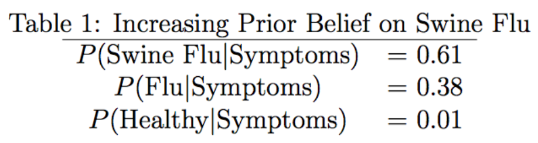

```{r setup, include=FALSE}
knitr::opts_chunk$set(echo = TRUE)
```

A really quick recap of probability followed by Bayes' theorem, the posterior distribution, and maximum likelihood estimation.  

This [cheatsheet](https://static1.squarespace.com/static/54bf3241e4b0f0d81bf7ff36/t/55e9494fe4b011aed10e48e5/1441352015658/probability_cheatsheet.pdf) is a useful resource and does a good job at covering salient topics in probability. If you are struggling with some of the concepts mentioned there then you can refer to the [textbook](https://www.amazon.com/gp/product/1466575573/ref=as_li_tl?ie=UTF8&camp=1789&creative=390957&creativeASIN=1466575573&linkCode=as2&tag=datascientist-20&linkId=DMC64XQVG4QHMHVQ) that it is based on.

## Introduction

Before we talk about Bayes' theorem we need to recall some important definitions and concepts in probability theory. If $X$ is a **random variable** then it is a *function* that maps from the sample space to real numbers. For example, in a single coin toss the outcome is getting a heads or a tails. and our random variable $X$ maps these sample space outcomes to real numbers; X(heads) = 1, X(tails) = 0. We often use $P(X=x)$ to represent the probability that the random variable $X$ is equal to a particular value $x$. Continuing with the example, $P(X=1)=0.5$ for a fair coin. We came to this conclusion because $P$ represents a **probability function** that assigns a value to $X=x$ relative to the random variable's mass under the function.

We can have **discrete random variables** and **continuous random variables**. For a discrete random variable we have a **probability mass function** $f(x) = P(X=x)$ that evaluates the probability (mass) associated with a particular realization of a random variable. If we sum across some values of $x$ then we have the probabilty associated with this set of values. Specifically if we sum from $-\infty$ to some value $x$ then we have the **cumulative mass function**, which represents the probability that the random variable is less than or equal to some value $x$. (Note that the CMF is a step function that is not differentiable). For a continuous random variable we start with the **cumulative distribution function** which, analogous to the CMF, evaluates the probability that the random variable is less that or equal to a particular value. Differentiating the CDF with respect to the random variable $x$ gives the **probability density function**. The main difference between discrete and continuous random variables is that the the probability of a point is zero for all continuous random variables, whereas the PMF will actually give a probability greater than or equal to zero depending on the mass under the curve for that observation. This is because the PMF is jumping discretely between values where as the PDF has a smooth (continuous) transition from one value to the next. If we are interested in the probability associated with a continuous random variable $x$ then we can use the CDF to evaluate $F(x+\varepsilon) - F(x-\varepsilon)$ where $\varepsilon$ is a small negligible perturbation. Note that PMFs and PDFs are nonnegative, and PMFs sum to 1 whereas PDFs integrate to 1 (over the random variable they are describing).

Below is a list of the main components of a PMF/PDF:  

 * **Normalizing constant** - the probability function may require a constant (not a function of the random variable) that allows it to sum/integrate to one.  
 * **Kernel** - the part of the probability function that depends on the random variable.
 * **Support** - the values of the random variable for which the probability function is defined.
 * **Parameters** - variables that govern features of the probability function (e.g. the shape of the graph of the function).

For example let $x \sim Beta(\alpha,\beta)$. The functional form is as follows,
$$
\big[B(\alpha,\beta)\big]^{-1}x^{\alpha-1}(1-x)^{\beta-1}
$$
The kernel of this function is $x^{\alpha-1}(1-x)^{\beta-1}$ and the normalizing constant is $\big[B(\alpha,\beta)\big]^{-1}$ where $B(\cdot)$ is the beta function. The support of the function is x being continuous on the closed unit interval, $x\in[0,1]$. The parameters $\alpha$ and $\beta$ are positive real numbers. 

Some useful properties of distribution functions:

* The derivative of the CDF gives the PDF: $\int_{a}^{x} F_{x}(x)\ dx = f_{x}(x)$, where $a$ is the lower bound of the support.  
* The joint distribution is equal to the product of independent marginal distributions: $f_{xy}(x,y) = f_{x}(x)\cdot f_{y}(y)$
* The conditional distribution requires you to redefine the sample space based on the conditional information: $f_{x|y}(x|y) = f_{xy}(x,y)/f_{y}(y)$.
* We can eliminate a random variable from the joint distribution by integrating/summing over the variable we want to "marginalize" out of the distribution: $\int_{xy}f(x,y)\ dy = f_{x}(x)$.

We are often interested in the expected value that a probability distribution will generate. The **expected** value of a PMF/PDF is defined as the sum/integral of the product of the random variable and its associated PMF/PDF over the random variable. 
$$
\mbox{continuous random variable}\ \implies E[x] = \int_{x\in X} x \cdot f(x)\ dx \\
\mbox{discrete random variable}\ \implies E[x] = \sum_x x \cdot f(x)
$$
This can be thought of as weighting the random variable by its corresponding mass (or frequency of occurance). The sample mean is a special case of the expected value where the weights associated with each value are all equal. 

The **law of the unconscious statistician** states that if we have a function $g(x)$ of our random variable $x$ then we can just replace $x$ with $g(x)$ in the defnition of the expectation. This result is useful since it saves us from having to compute the PMF/PDF of $g(x)$.
$$
\mbox{continuous random variable}\ \implies E[g(x)] = \int_{x\in X} g(x) \cdot f(x)\ dx \\
\mbox{discrete random variable}\ \implies E[g(x)] = \sum_x g(x) \cdot f(x)
$$
Other important discriptors include the median and the mode of the distribution. If we arrange a set of observations in a sequence then the **median** is the value at which half of the observations are below and half of the observations are above. In terms of the PMF/PDF we can find this value by computing $x=F^{-1}(0.5)$ where $F^{-1}$ is the inverse CMF/CDF (also known as the **quantile function**). The **mode** is the observation that occurs most frequently. This value of the random variable that achieves the maximum of the graph of the PMF/PDF.

The expected value of a random variable will define the center of mass of a distribution. We are also interested in the spread of a distribution, which is encapsulated in its variance. The **variance** of the random variable $x$ is defined as the expectation of the squared difference between the random variable and its expected value,
$$
Var[x] = E\left\{\left(x-E[x]\right)^2\right\} 
= E[x^2] - E[x]^2 
$$

Typically, distributions that have a large variance have a wider center of mass. We also have other interesting properties that govern the shape of a distribution such as **skewness** (lack of symmetry) and **kurtosis** (heavy tails). 

In R we can access the random number generator, PMF/PDF, CMF/CDF, and quantile function of various distributions using prefixes `r`, `d`, `p`, and `q`, respectively, on the abbreviated name of the distribution. For example R has the functions listed below to work with the exponential distribution,

 * `rexp()` : generate random values according to the exponential distribution.
 * `dexp()` : evaluate the PDF at some value according to a prespecified rate parameter. (PMF for discrete random variables.)
 * `qexp()` : evaluate the quantile function at some value.
 * `pexp()` : evaluate the CDF at some value according to a prespecified rate parameter. (CMF for discrete random variables.)
 
## Bayes' Theorem

We can formulate Bayes' theorem by using the definition of independence of events from probability theory. Recall, if event $A$ and event $B$ are **independent events** then the joint probability of both $A$ and $B$ occurring is defined using the product rule. Specifically,
$$
P(A,B) = P(A)\cdot P(B)
$$

 If events  $A$ and $B$ are **not-independent events** then the joint probability is defined as,
$$
P(A,B) = P(A|B)\cdot P(B)
$$
or,
$$
P(A,B) = P(B|A)\cdot P(A)
$$

Given that both definitions for non-independent events yield the same joint probability we can set them equal to one another and solve for one of the conditional probabilities which gives us Bayes' theorem, 
$$
\begin{aligned}
P(A|B)\cdot P(B) &= P(B|A)\cdot P(A) \\
P(A|B) &= \frac{P(B|A)\cdot P(A)}{P(B)} \\
& \mbox{or} \\
P(B|A) &= \frac{P(A|B)\cdot P(B)}{P(A)} \\
\end{aligned}
$$

 Often we are interested in discovering the parameter that controls the data generating process. For example, say we have some data $y$ that was generated by some unknown parameter $\theta$, which also comes from some distribution. In other words, $y$ is distributed according to the distribution $p(y | \theta)$. Using the definition of independence we can write down a function for the unknown parameter conditional on the data using Bayes' theorem,
$$
\begin{aligned}
p(\theta|y)p(y) &= f(y|\theta)g(\theta) \\
p(\theta|y) &= \frac{f(y|\theta)g(\theta)}{f_y(y)}
\end{aligned}
$$

 What this is saying is that the distribution of the unknown parameter of interest $\theta$ given the data $y$ is equal to the product of the likelihood of the data $f(y|\theta)$ and the prior distribution of the parameter $g(\theta)$ divided by the marginal distribution of the data $f_y(y)$. \\

 The **likelihood function** describes the probability density or probability mass of obtaining the data given the parameter value. It is a function of the unknown parameter $\theta$. The maximum of this function corresponds to the value of the parameter such that the most likely data to observe is $y$. Formally, the likelihood $\mathcal{L}(\theta|y)$ is the product of individual densities of $y$ given $\theta$,
$$
\mathcal{L}(\theta|y) = f(y|\theta) = \prod_{i=1}^n f(y_i|\theta)
$$ 
since this gives us the joint probability of obtaining the $n$ observations given the parameter $\theta$.\\

 Because of computational underflow issues (i.e. rounding numbers close to zero down to zero) we often work with the log of the likelihood function,
$$
\log(\mathcal{L}(\theta|y)) = \log(f(y|\theta)) = \sum_{i=1}^n \log(f(y_i|\theta))
$$

Because the natural logarithm monotonically increasing, the parameter value that maximizes the log-likelihood will be the same as the parameter value that maximizes the likelihood.

The **prior distribution** refers to the distribution that you have assigned to the parameter $\theta$ itself. It reflects the prior beliefs you have about the parameter. An **informative prior** provides specific information about the parameter, whereas a weakly informative or uninformative prior will provide more generic information. For example, if our parameter is a probability, then a **weakly informative** or **uninformative prior** would define the parameter as coming from the a distribution bound between 0 and 1. On the other hand, an informative prior might place high probability on the parameter being closer to 1, if you believe the true parameter is close to this value. If the PMF/PDF of the prior does not integrate to one then the prior is considered an **improper prior**.

The **marginal distribution of the data** can be interpreted as the expected value of the data over the parameter, $E_\theta(y)$. Since $y$ depends on $\theta$, the expected value for discrete distributions is,
$$
f_y(y) = \sum_{\theta}f(y|\theta)g(\theta)
$$
and the expected value for continuous distributions is,
$$
f_y(y) = \int_{\Omega}f(y|\theta)g(\theta)d\theta
$$

This is why $p(y)$ is sometimes referred to as being obtained by integrating the parameter out of the distribution. We are essentially looking for the expected value of $y$ by considering all possible parameter values. What this means is that, for all candidate parameter values, we are finding the product of the density of the likelihood at each parameter value and the density of the prior at that same parameter value and summing (or integrating) the result of all these products.

Note that Bayes' theorem can be written as a proportion,
$$
p(\theta|y) \propto f(y|\theta)g(\theta)
$$
This term is also known as the *kernel* of the distribution if the components of the distribution depend *only* on the domain (in this case $\theta$). We can write this as a proportion since the marginal distribution $p(y)$ does not depend on $\theta$. It is a constant, since we summed (or integrated) $\theta$ out in order to evaluate it. The use of dividing by $p(y)$ is to ensure that the area under the posterior density $p(\theta|y)$ sums/integrates to one. Notice that since $p(y)$ is a constant, it identically scales the kernel for each candidate value of the parameter. So, the relative difference of $p(\theta|y)$ for the different values of $\theta$ remains unchanged if it is omitted.

This simplifies the problem since we only have to find $p(y|\theta)p(\theta)$. This will give us the frequency for which each candidate value of $\theta$ can occur, which in turn, through sampling a set of candidate parameter values, allows us to find the posterior distribution $p(\theta|y)$. We can then find the appropriate value of $\theta$ associated with the peak of this distribution. 


### Discrete Probability Example

Consider a set of symptoms that determine whether an individual has swine flu or not. Also note that the initial symptoms of swine flu are similar to the conventional flu so it is up to the medical practitioner to determine whether the patient has swine flu or not.

Specifically the practitioner is interested in the probability of having swine flu given a set of symptoms. Let the world we live in consist of either people with symptoms or people without symptoms. Assume that swine flu occurs in the population with probability 0.01. Let the conventional flu occur more frequently, with probability 0.04. Lastly, the probability of a healthy individual is fairly high, at 0.90. These are our prior beliefs about the population.

Through observation our data tells us that the probability an individual exhibits symptoms given the individual has the conventional flu is 0.90. If the individual has the swine flu he is more likely to exhibit the symptoms than if he has the conventional flu, specifically with probability 0.95. The probability of exhibiting the symptoms given that the individual is healthy is 0.001 (i.e. a healthy individual is unlikely to exhibit any symptoms).

Now we can formulate the probability that the individual has swine flu given the symptoms using Bayes' theorem,
$$
P(\mbox{Swine Flu} | \mbox{Symptoms}) = \frac{P(\mbox{Symptoms} | \mbox{Swine Flu})P(\mbox{Swine Flu})}{P(\mbox{Symptoms})} \\
$$

where,

$$
P(\mbox{Symptoms})=P(\mbox{Symptoms} | \mbox{Swine Flu})P(\mbox{Swine Flu})+P(\mbox{Symptoms} | \mbox{Flu})P(\mbox{Flu})+P(\mbox{Symptoms} | \mbox{Healthy})P(\mbox{Healthy})
$$

Evaluating the conditional probability for swine flu we have,
$$
P(\mbox{Swine Flu} | \mbox{Symptoms}) = \frac{(0.95)(0.01)}{(0.95)(0.01)+(0.90)(0.04)+(0.001)(0.90)} \approx 0.20 \\
$$

Similarly, we can show that the probability that an individual is healthy given that they exhibit symptoms is around 0.02 and the probability that an individual has the conventional flu given that they exhibit symptoms is around 0.78 (the most probable scenario given the symptoms, followed by swine flu).

So even though $P(\mbox{Symptoms} | \mbox{Swine Flu})>P(\mbox{Symptoms} | \mbox{Flu})$, incorporating our prior beliefs suggests that an individual is more likely to have the conventional flu rather than swine flu if they exhibit the symptoms.

If our prior beliefs change (e.g. due to an outbreak of swine flu) so that we now believe that the probability of swine flu in the population is 0.06 then our conditional probabilities adjust accordingly (see below).

<br>
<center>
<div style="width:350px">

</div>
</center>
<br>

So given that our adjusted prior beliefs reflect a higher prevalence of swine flu in the population (compared to the conventional flu) our conditional probability reflects that the symptoms are most likely a result of being infected with swine flu. You can see how this is useful if, for instance, we want to associate distinct priors for specific regions. Higher prior probabilities can be applied to regions that are currently experiencing an outbreak.

The R code below evaluates these probabilities.

```{r eval=FALSE}
# We are interested in finding P ( swineflu | symptoms ) = P ( symptoms | swineflu ) P ( swineflu )/P ( symptoms )
# Likelihoods
symptoms_swineflu <- 0.95
symptoms_flu <- 0.90
symptoms_healthy <- 0.001
# Priors
swineflu <- 0.01
flu <- 0.04
healthy <- 0.90
# Marginal distribution of the data
denominator <- symptoms_swineflu * swineflu + symptoms_flu * flu + symptoms_healthy * healthy
# Conditional probabilities
symptoms_swineflu * swineflu / denominator    # P ( swineflu | symptoms )
symptoms_flu * flu / denominator              # P ( flu | symptoms )
symptoms_healthy * healthy / denominator      # P ( healthy | symptoms )
# Check probabilities sum to one
sum ( symptoms_swineflu * swineflu / denominator
+ symptoms_flu * flu / denominator
+ symptoms_healthy * healthy / denominator )
# Raising the prior belief about swine flu in the population
swineflu <- 0.06
denominator <- symptoms_swineflu * swineflu + symptoms_flu * flu + symptoms_healthy * healthy
symptoms_swineflu * swineflu / denominator   # P ( swineflu | symptoms )
symptoms_flu * flu / denominator             # P ( flu | symptoms )
symptoms_healthy * healthy / denominator     # P ( healthy | symptoms )
```

### Functional Form of the Posterior

Here we consider an example of the posterior distribution using the binomial distribution as the likelihood and the beta distribution and the prior.

The binomial distribution allows us to model the the probability $\theta$ of successes $k$ in a sample size $n$. Consider $J$ observations of successes given a sample size, where $k_j\sim\mbox{Binomial}(n,\theta)$ for $j=1,\ldots,J$. Since $\theta$ is a probability we can specify a prior distribution on it that is bound between 0 and 1, for example $\theta\sim\mbox{Beta}(\alpha,\beta)$. Now we have the components of our posterior distribution. Formally,
$$
p(\theta|k,n,\alpha,\beta) \propto 
\underbrace{\prod_{j=1}^{J} \frac{n!}{k_j!(n-k_j)!}\theta^{k_j}(1-\theta)^{n-{k_j}}}_\text{likelihood} 
\underbrace{\frac{\theta^{\alpha-1}(1-\theta)^{\beta-1}}{B(\alpha,\beta)}}_\text{prior}
$$
where the beta function $B(\alpha,\beta)=\frac{(\alpha-1)!(\beta-1)!}{(\alpha+\beta-1)!}$.

The log posterior is,
$$
\log[p(\theta|k,n,\alpha,\beta)] \propto
\sum_{j=1}^{J} \log\left[ \frac{n!}{k_j!(n-k_j)!}\right] 
+ \log\left[ \theta^{k_j}(1-\theta)^{n-{k_j}} \right] 
+ \log\left[ \theta^{\alpha-1}(1-\theta)^{\beta-1} \right] 
- \log\left[ B(\alpha,\beta) \right]
$$

We can simplify this further, but first remember that all we need to work with is the kernel of the posterior distribution. Therefore we have can drop the parts of the log posterior that are not a function of $\theta$. (Remember that we know $n,k$ from our data and we set $\alpha,\beta$ based on our prior beliefs. The only unknown is $\theta$.),
$$
\begin{aligned}
\log[p(\theta|k,n,\alpha,\beta)] &\propto
\sum_{j=1}^{J} \log\left[ \theta^{k_j}(1-\theta)^{n-{k_j}} \right] 
+ \log\left[ \theta^{\alpha-1}(1-\theta)^{\beta-1} \right] \\
&\propto
\sum_{j=1}^{J} k_j\log(\theta)+(n-{k_j})\log(1-\theta)
+ (\alpha-1)\log(\theta)+(\beta-1)\log(1-\theta) 
\end{aligned}
$$

The last line gives us the kernel of the log posterior distribution.

We can differentiate this and solve for $\theta$ this in order to find the parameter value that maximizes the log posterior. Alternatively, we can use sampling techniques in order to find the parameter value that maximizes the log posterior distribution of $\theta$ (e.g. sampling from a grid, Metropolis algorithm, the Hamiltonian Monte Carlo algorithm, etc.). 

## Maximum Likelihood Estimation

Maximum likelihood is a method to find parameter values for a model given some data. Simply put, the **maximum likelihood estimate** of a parameter value is the value that maximizes the probability of obtaining the observed data, as defined by the likelihood function. We are *not* incorporating prior information about the parameter.

As mentioned above, the likelihood function of some vector of data $y_i$ is the probability of obtaining $y_i$ given some parameter value $\theta$. We can find this by taking the product of each of the individual densities $y_i$ given $\theta$. 
$$
p(y|\theta) = \prod_{i=1}^nf(y_i|\theta)
$$

Note that $f(y|\theta)$ is a function of $\mathcal{L}(\theta;y)$. By solving for $\theta$ we can find the parameter value that maximizes the likelihood of obtaining the data (i.e. the maximum likelihood estimate of $\theta$). As mentioned before we often work with the log of the likelihood function since it is more tractable. 

### Maximum Likelihood from Bayes' Theorem

Maximum likelihood estimation can be thought of as a special case of the Bayesian posterior distribution where the prior distribution is constant for all candidate parameter values. So the mode of following posterior distribution,
$$
p(\theta|y) \propto f(y|\theta)g(\theta)
$$
is identical to the maximum likelihood estimate of $\theta$ when $p(\theta)$ follows the uniform distribution. In which case we would have,
$$
p(\theta|y) \propto f(y|\theta)
$$

Consider a vector of n observations $y\sim\mathcal{N}(\mu,\sigma)$. If we did not know the mean and standard deviation parameters responsible for generating the data, we can find them by finding the maximum of the likelihood function with respect to each of the parameters. We start by forming the likelihood function, 

$$
\begin{aligned}
p(y|\mu,\sigma) &= \prod_{i=1}^{n} \frac{1}{\sqrt{2\pi\sigma^2}}e^{-\frac{(y_i-\mu)^2}{2\sigma^2}} \\
\log(p(y|\mu,\sigma)) &= \sum_{i=1}^{n} \log(1) - \frac{1}{2}\log(2\pi\sigma^2) - \frac{(y_i-\mu)^2}{2\sigma^2} \\
&= \sum_{i=1}^{n} - \frac{1}{2}\log(2\pi\sigma^2) - \frac{(y_i-\mu)^2}{2\sigma^2} \\
&= \sum_{i=1}^{n} - \frac{1}{2}\left[ \log(2)+\log(\pi)+2\log(\sigma)\right] - \frac{(y_i-\mu)^2}{2\sigma^2} 
\end{aligned}
$$

Recall that the kernel is just the part of the likelihood function that is a function of the parameters $\mu$ and $\sigma$,
\[
\sum_{i=1}^{n} - \log(\sigma) - \frac{(y_i-\mu)^2}{2\sigma^2} 
\]

The parameters can be found by maximizing the likelihood function. That is, to find the arguments $\mu$ and $\sigma$ we maximize the likelihood function with respect to each of these arguments individually. For $\mu$ we have,
$$
\begin{aligned}
\tilde{\mu} &= \underset{\mu}{\mbox{argmax}} \sum_{i=1}^{n} - \log(\sigma) - \frac{(y_i-\mu)^2}{2\sigma^2}   \\ \sum_{i=1}^{n} \frac{(y_i-\mu)}{\sigma^2} &= 0 \\
\sum_{i=1}^{n} y_i - \sum_{i=1}^{n}\mu &=  0 \\
\sum_{i=1}^{n} y_i - n\mu &=  0 \\
n\mu &=  \sum_{i=1}^{n} y_i  \\
\tilde{\mu} &= \frac{1}{n}\sum_{i=1}^{n} y_i 
\end{aligned}
$$

and for $\sigma$ we have,
$$
\begin{aligned}
\tilde{\sigma} &= \underset{\sigma}{\mbox{argmax}} \sum_{i=1}^{n} - \log(\sigma) - \frac{(y_i-\mu)^2}{2\sigma^2}  \\
\sum_{i=1}^n -\frac{1}{\sigma} + \frac{(y_i-\mu)^2}{\sigma^3} &= 0 \\
 -\frac{n}{\sigma} + \frac{1}{\sigma^3} \sum_{i=1}^n (y_i-\mu)^2 &= 0 \\
 \frac{n}{\sigma}  &= \frac{1}{\sigma^3} \sum_{i=1}^n (y_i-\mu)^2 \\
  \tilde{\sigma}^2  &= \frac{1}{n} \sum_{i=1}^n (y_i-\mu)^2 \\
  \tilde{\sigma} &= \sqrt{\frac{1}{n} \sum_{i=1}^n (y_i-\mu)^2}
 \end{aligned}
$$

We can compute the maximum likelihood estimate by using the `optim()` function in R. The code below simulates the data from the Frequentist perspective of having fixed parameter values in the data generation process.

```{r include = TRUE}
# simulate data
y <- rnorm(1e5, 6, 1)
# specify the log likelihood function
lik <- function(par) {
  out <- sum(dnorm(y, par[1], par[2], log = TRUE))
  return(out)
}
# maximize with respect to mu and sigma
mle <- optim(c(0,1), lik, method = "L-BFGS-B", control = list(fnscale = -1), upper = c(10, 10), lower = c(-10, 0.01))$par
names(mle) <- c("mu", "sd")
round(mle, 2)
```

We can visually inspect the graph of the likelihood function to verify that the maximum is in fact attained at the mle values.
```{r echo = TRUE, fig.align='center', fig.width=9, fig.height=4}
mu_grid <- seq(-10, 10, length.out=100)
sd_grid <- seq(0.5, 1.5, length.out=100)
lik_y_mu <- NULL
lik_y_sd <- NULL
for(i in 1:length(mu_grid)) {
  lik_y_mu[i] <- sum(dnorm(y, mu_grid[i], 1, log = TRUE))
  lik_y_sd[i] <- sum(dnorm(y, 6, sd_grid[i], log = TRUE))
}

par(mfrow=c(1,2))
plot(mu_grid, lik_y_mu, type = "l", col = "darkgrey", lwd = 2,
     main = expression("MLE for " ~ mu), xlab = expression(mu), ylab = "Likelihood")
abline(v = mle[1], col = "red", lwd = 2)
plot(sd_grid, lik_y_sd, type = "l", col = "darkgrey", lwd = 2,
     main = expression("MLE for " ~ sigma), xlab = expression(sigma), ylab = "Likelihood")
abline(v = mle[2], col = "red", lwd = 2)
```

The code below simulates the data from a Bayesian perspective of the parameter values originating from some prior distribution. 
```{r }
remove(list = ls())
sd <- NULL
N <- 50
for(i in 1:N){
  sd[i] <- rnorm(1, 0, 1)
  while(sd[i] <= 0)
    sd[i] <- rnorm(1, 0, 1)
}
y <- rnorm(N, rnorm(N, 6, 15), sd)
lik <- function(par) {
  out <- sum(dnorm(y, par[1], par[2], log = TRUE))
  return(out)
}
mle <- optim(c(0,1), lik, method = "L-BFGS-B", control = list(fnscale = -1), upper = c(10, 10), lower = c(-10, 0.01))$par
names(mle) <- c("mu", "sd")
round(mle, 2)
```

Note that in the Bayesian example we reduced the number of observations so as to induce a balance between model complexity and a large number of observations. If you have a overly simple model then you're most probably going to get the right parameter values through MLE. However, most problems are complex (involving a large number of parameters and and extreme number of observations).

## Aside: Universality of the Uniform

This is a particularly useful property, especially if you're interested in generating random values out of a distribution function. The **Universality of the Uniform** states that any CMF/CDF is distributed $Unif(0,1)$ (i.e. the probability of a random variable being less than or equal to a certain value has to be somewhere between 1 and 0 by the definition of probability). Formally,
$$
F(x) \sim  Unif(0,1) \implies x \sim F^{-1}(u)
$$
where $u$ is a uniformly distributed random variable between 0 and 1. In other words, using the properties of CMFs and CDFs, we can use the uniform distribution to generate random values out of our target distribution. (This is not always straightforward since $F^{-1}$ may not be tractable.)

The code below generates random values of the exponential distribution by using its inverse CDF and compares it to `rexp()` in R.

```{r include = TRUE, fig.align='center', fig.width=9, fig.height=4}
lambda <- 2
u <- runif(1e4, 0, 1)
x <- log(1-u)/(-lambda)
par(mfrow=c(1,2), oma=c(0,0,2,0))
hist(x, breaks = 50, col = "darkgrey", border = FALSE, freq = FALSE,
     main = "University of the Uniform")
abline(v = mean(x), col = "red", lwd = 2)
text(2,1, paste0("mean = ",round(mean(x),4)), cex = 0.8)
y <- rexp(1e4, lambda)
hist(y, breaks = 50, col = "darkgrey", border = FALSE, freq = FALSE,
     main = "Using rexp() in R")
abline(v = mean(y), col = "red", lwd = 2)
text(2,1, paste0("mean = ",round(mean(y),4)), cex = 0.8)
title("Exponential Random Number Generation", outer = TRUE)

```
