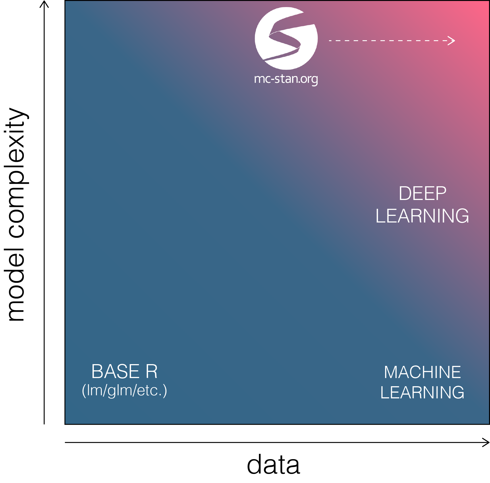
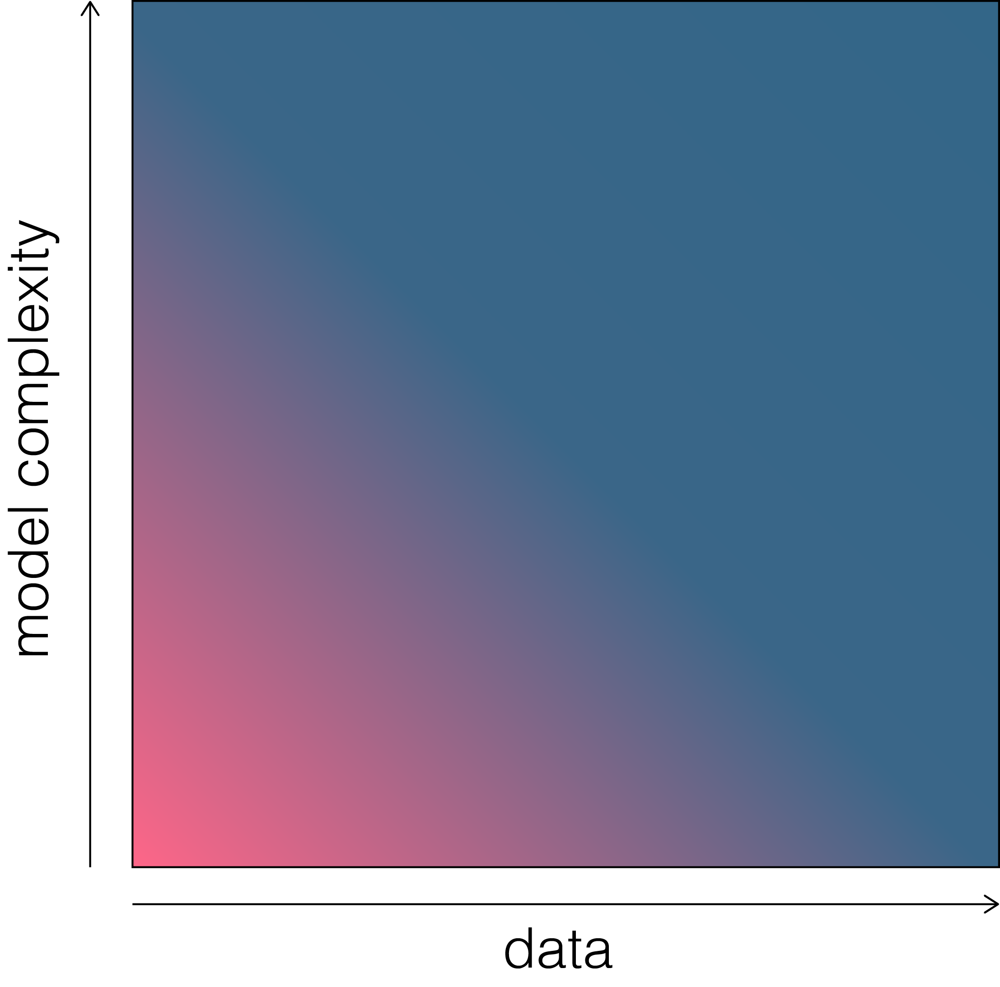
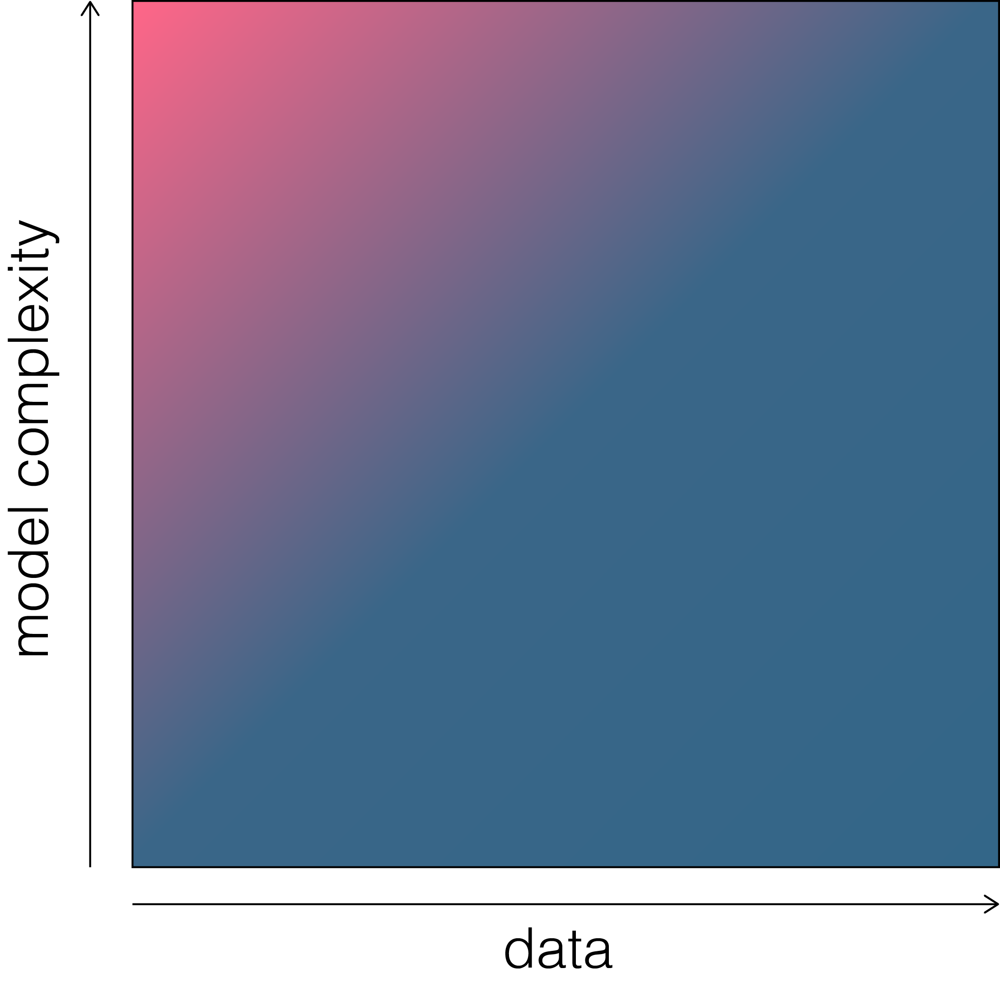
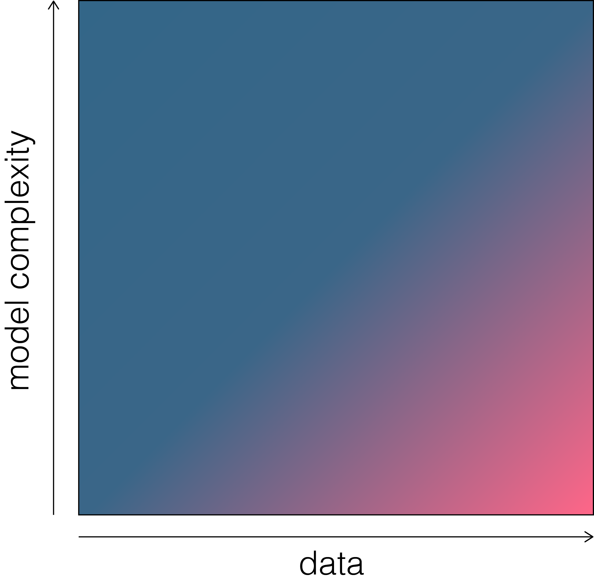
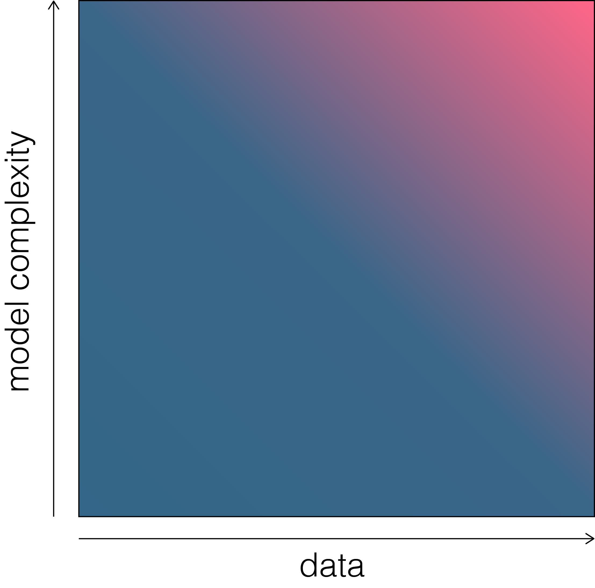

```{r setup, include=FALSE}
knitr::opts_chunk$set(echo = TRUE)
```

## Introduction

The purpose of this note is two-fold. First, we want to empirically explore how prior distributions influence posterior distributions. Second, we want to explore the trade-off between model complexity and big data. Most techiques taught in Statistics deal with naive models and small data, while the machine learning community tends to deal with simple models and large amounts of data. Bayesian approaches are particularly useful at capturing uncertainty in the parameters, with sparse data and complex models. With implementations like [Stan](mc-stan.org), Bayesian methods are heading in a direction which will allow efficient computation on big data without without losing the transparency of directly specifying your model.  

<br>

<!---
```{r echo=FALSE, fig.align='center', fig.height=5, fig.width=5}
plot(0,0, type = "n", bty = "n", axes = FALSE,
     xlab = "Number of Observations", ylab = "Number of Parameters", cex.lab = 1.2,
     xlim = c(0,1), ylim = c(0,1), mgp = c(1,0,0))
arrows(0,0.1,0,1, length = 0.1)
arrows(0.1,0,1,0, length = 0.1)
text(0.2,0.2, "Base R\nModeling")
text(0.9,0.2, "Machine\nLearning")
text(0.9,0.6, "Deep\nLearning")
text(0.5,0.9, "Stan", col = "#971818", font = 2)
arrows(0.6,0.9,0.9,0.9, lwd = 2, col = "#971818", length = 0.1)
```
--->

<center>
<div style="width:400px">

</div>
</center>

## One Observation and One Parameter
<br>
<center>
<div style="width:400px">

</div>
</center>

### Belief about the data/model

Assume you have a single observation $y$ that you *believe* has been generated from the binomial distribution according to some unknown probability parameter $\theta$ and some known sample size $n$. For example, you have data on $n$ (Bernoulli) experiments and information on how many of the $n$ experiments resulted in a success, denoted $y$. In addition to the prior distribution being bound on the closed unit interval [0,1], you might also have some prior knowledge as to the distribution that $\theta$ comes from. This might arise from domain specific knowledge and might encourage you to believe that $\theta$ is close to (or far from) some set of values on the closed unit interval.

We can specify our belief about the model and prior information using Bayes' theorem:
$$
p(\theta | y) = \frac{f(y | \theta)g(\theta)}{\int_{\Omega}f(y | \theta)g(\theta)\ d\theta}
$$

Given that our single observation comes from the binomial distribution, the likelihood of our data $f(y | \theta)$ is simply the binomial probability mass function for $y$ given $\theta$. Formally,

$$
f(y|\theta) = \binom{n}{y}\theta^{y}(1-\theta)^{n-y}
$$

As [previously discussed](), Frequentists will tend to stop here and find the maximum likelihood estimate for $\theta$ (i.e. the value of $\theta$ that maximizes the (joint) probability of observing the data).

### Belief about the parameter

Our domain specific knowledge might lead us to consider various distributional specifications for our prior distribution $g(\theta)$. Here we will consider the [beta](), [uniform](), [normal](), and [Cauchy]() distributions as prior distributions for $\theta$:
$$
\begin{aligned}
g_b(\theta | \alpha, \beta) &= \frac{\theta^{\alpha - 1}(1-\theta)^{\beta - 1}}{B(\alpha,\beta)} \\
g_u(\theta) &= 1 \\
g_n(\theta | \mu, \sigma) &= \left[\sigma\sqrt{2\pi}\right]^{-1}e^{- \frac{(\theta - \mu)^2}{2\sigma^2}} \\
g_c(\theta | x_0, \gamma) &= \left\{\pi\gamma\left[1+\left(\frac{\theta - x_0}{\gamma}\right)^2\right]\right\}^{-1}
\end{aligned}
$$

Our posterior distribution of $\theta$ will adjust depending on the functional form used on the parameter $\theta$. Why? Because we are probabilistically weighting values of $\theta$ in addition to determining how *likely* these values are to have generated the data. If we are just interested in the value of $\theta$ that is most likely to generate the data then we are not saying anything about which values of $\theta$ are more likely. However, by defining $\theta$ as a random variable that comes from a probability distribution, we can make a probabilistic statement about which values of $\theta$ are more likely to occur. We have a probability distribution that describes $\theta$ both before and after observing the data (prior and posterior, respectively).

### Sampling from the grid

Sampling from the grid (or grid approximation) can be thought of as a "brute force" way to estimate your posterior distribution. Its name derives from the procedure of using a "grid" of candidate parameter values (e.g. a vector or a matrix) to determine your posterior probabilities associated with each candidate parameter or candidate $k$-tuple of parameters (for models with $k$ parameters). We can then use these posterior probabilities to sample from the grid of parameter values (with replacement). This will give us a distribution associated with the parameter.

In order to sample from the grid we need to specify a function that can compute the posterior probability associated each candidate value (or at least the probability up to a normalizing constant). We also need a function to sample from the grid of candidate parameter values using the posterior probability associated with each value. The `sample()` function in R can be used to accomplish this. However, in this section we do not sample, but rather plot the posterior distribution associated with each candidate parameter value. In other words, we are looking at the distribution that the posterior samples will converge to as the number of samples approaches infinity. Posterior values are sampled from the grid in starting with the [next section](#oneobservationandmultipleparameters).

Below is the R code to calculate the posterior probabilities of each value of $\theta$ using beta, uniform, normal, and Cauchy prior distributions, respectively. The first three lines setup the grid and the data.

```{r posterior_fun, include=TRUE}
prob <- seq(0, 1, by=0.01)  # grid of candidate parameter values (theta)
x <- 5                      # number of successes
n <- 10                     # number of trials

# beta prior
binom_beta <- function(x, n, theta, alpha, beta) {
  lik <- dbinom(x, n, theta)
  prior <- dbeta(theta, alpha, beta)
  post <- (lik * prior) / sum(lik * prior)
  return(list('lik' = lik, 'prior' = prior, 'post' = post))
}
# uniform prior
binom_unif <- function(x, n, theta, alpha, beta) {
  lik <- dbinom(x, n, theta)
  prior <- dunif(theta, alpha, beta)
  post <- (lik * prior) / sum(lik * prior)
  return(list('lik' = lik, 'prior' = prior, 'post' = post))
}
# normal prior
binom_norm <- function(x, n, theta, loc, scale) {
  lik <- dbinom(x, n, theta)
  prior <- dnorm(theta, loc, scale)
  post <- (lik * prior) / sum(lik * prior)
  return(list('lik' = lik, 'prior' = prior, 'post' = post))
}
# cauchy prior
binom_cauchy <- function(x, n, theta, loc, scale) {
  lik <- dbinom(x, n, theta)
  prior <- dcauchy(theta, loc, scale)
  post <- (lik * prior) / sum(lik * prior)
  return(list('lik' = lik, 'prior' = prior, 'post' = post))
}
```


The code below runs through the `binom_beta()` function which uses the $Beta(\alpha,\beta_i)$ prior distribution with $\alpha = 2$ and increasing values for $\beta_i\in[2,11]$. We then plot the distribution of the likelihood of the data, the distribution of the prior on $\theta$, and the posterior distribution of $\theta$. The figure below illustrates the relationship between the prior and the posterior as the Beta prior belief on probability shifts towards zero.

```{r, echo=FALSE, fig.align='center', fig.height=3, fig.width=9}
# color palette
retro <- colorRampPalette(c("#ec5f9f", "#c55997", "#945393", "#745394", "#535294"))(8)
# iterate through different distributions
post_samples <- list()
for(i in 0:8) {
  post_samples[[i+1]] <- binom_beta(x, n, prob, 2 , 2 + i)
}
# plotting
par(mfrow=c(1,3))
plot(prob, post_samples[[1]]$lik, type = "l", col = "darkgrey", lwd = 2, xlab = expression(theta), ylab = "Density",
     main = "Binomial Likelihood", cex.lab = 1.5)
plot(prob, post_samples[[1]]$prior, type = "l", col = "darkgrey", lwd = 2,
     ylim = c(0,4.5), cex.lab = 1.5,
     xlab = expression(theta), ylab = "", main = "Beta Prior")
for(i in 2:8) {
  lines(prob, post_samples[[i]]$prior, col = retro[i], lwd = 2)
}
plot(prob, post_samples[[1]]$post, type = "l", col = "darkgrey", lwd = 2,
     ylim = c(0, 0.042), cex.lab = 1.5,
     xlab = expression(theta), ylab = "", main = "Beta-Binomial Posterior")
for(i in 2:8) {
  lines(prob, post_samples[[i]]$post, col = retro[i], lwd = 2)
}
```

The figure below shows the relationship of the prior and the posterior as the Beta prior belief on probability shifts towards one. In this case the prior is using $\alpha_i\in[2,11]$ and $\beta = 2$.

```{r, echo=FALSE, fig.align='center', fig.height=3, fig.width=9}
post_samples <- list()
for(i in 0:8) {
  post_samples[[i+1]] <- binom_beta(x, n, prob, 2 + i , 2)
}
par(mfrow=c(1,3))
plot(prob, post_samples[[1]]$lik, type = "l", col = "darkgrey", lwd = 2, xlab = expression(theta), ylab = "Density",
     main = "Binomial Likelihood", cex.lab = 1.5)
plot(prob, post_samples[[1]]$prior, type = "l", col = "darkgrey", lwd = 2,
     ylim = c(0,4.5), cex.lab = 1.5,
     xlab = expression(theta), ylab = "", main = "Beta Prior")
for(i in 2:8) {
  lines(prob, post_samples[[i]]$prior, col = retro[i], lwd = 2)
}
plot(prob, post_samples[[1]]$post, type = "l", col = "darkgrey", lwd = 2,
     ylim = c(0, 0.042), cex.lab = 1.5,
     xlab = expression(theta), ylab = "", main = "Beta-Binomial Posterior")
for(i in 2:8) {
  lines(prob, post_samples[[i]]$post, col = retro[i], lwd = 2)
}
```

Using a $Unif(0,1)$ prior does not change the shape of the posterior (i.e. no prior information is being encoded in the model since the uniform probability density function is constant (either zero or one in this case) for all values in its support).

```{r echo=FALSE, fig.height=3, fig.width=9}
post_samples <- list()
for(i in 0:8) {
  post_samples[[i+1]] <- binom_unif(x, n, prob, 0 , 1)
}

par(mfrow=c(1,3))
plot(prob, post_samples[[1]]$lik, type = "l", col = "darkgrey", lwd = 2, xlab = expression(theta), ylab = "Density",
     main = "Binomial Likelihood", cex.lab = 1.5)
plot(prob, post_samples[[1]]$prior, type = "l", col = "darkgrey", lwd = 2,
     ylim = c(0,1.5), cex.lab = 1.5,
     xlab = expression(theta), ylab = "", main = "Uniform Prior")
for(i in 2:9) {
  lines(prob, post_samples[[i]]$prior, col = retro[i-1], lwd = 2)
}
plot(prob, post_samples[[1]]$post, type = "l", col = "darkgrey", lwd = 2,
     ylim = c(0, 0.03), cex.lab = 1.5,
     xlab = expression(theta), ylab = "", main = " Posterior")
for(i in 2:9) {
  lines(prob, post_samples[[i]]$post, col = retro[i-1], lwd = 2)
}
```

The figure below shows the relationship between the prior and the posterior when using a truncted $\mathcal{N}(\mu_i,\sigma)$ prior with $\mu_i\in[0,0.8]$ and $\sigma = 1$. This is a less "extreme" approach compared to the beta prior distribution.

```{r echo=FALSE, fig.height=3, fig.width=9}
post_samples <- list()
for(i in 0:8) {
  post_samples[[i+1]] <- binom_norm(x, n, prob, 0 + i * 0.1, 1)
}

par(mfrow=c(1,3))
plot(prob, post_samples[[1]]$lik, type = "l", col = "darkgrey", lwd = 2, xlab = expression(theta), ylab = "Density",
     main = "Binomial Likelihood", cex.lab = 1.5)
plot(prob, post_samples[[1]]$prior, type = "l", col = "darkgrey", lwd = 2,
     ylim = c(0,0.5), cex.lab = 1.5,
     xlab = expression(theta), ylab = "", main = "Normal Prior")
for(i in 2:9) {
  lines(prob, post_samples[[i]]$prior, col = retro[i-1], lwd = 2)
}
plot(prob, post_samples[[1]]$post, type = "l", col = "darkgrey", lwd = 2,
     ylim = c(0, 0.03), cex.lab = 1.5,
     xlab = expression(theta), ylab = "", main = " Posterior")
for(i in 2:9) {
  lines(prob, post_samples[[i]]$post, col = retro[i-1], lwd = 2)
}
```

The figure below shows the relationship between the prior and the posterior when using a truncted $\mathcal{N}(\mu,\sigma_i)$ prior with $\mu = 0$ and $\sigma_i = [0.2,1]$. Notice that shifting the scale parameter greatly affects the shape of the prior, and thus the posterior, distributions. In this case more weight is being placed on values of $\theta$ closer to zero as the standard deviation shrinks towards 1.

```{r echo=FALSE, fig.height=3, fig.width=9}

post_samples <- list()
for(i in 0:8) {
  post_samples[[i+1]] <- binom_norm(x, n, prob, 0, 1 - i * 0.1)
}

par(mfrow=c(1,3))
plot(prob, post_samples[[1]]$lik, type = "l", col = "darkgrey", lwd = 2, xlab = expression(theta), ylab = "Density",
     main = "Binomial Likelihood", cex.lab = 1.5)
plot(prob, post_samples[[1]]$prior, type = "l", col = "darkgrey", lwd = 2,
     ylim = c(0,2), cex.lab = 1.5,
     xlab = expression(theta), ylab = "", main = "Normal Prior")
for(i in 2:9) {
  lines(prob, post_samples[[i]]$prior, col = retro[i-1], lwd = 2)
}
plot(prob, post_samples[[1]]$post, type = "l", col = "darkgrey", lwd = 2,
     ylim = c(0, 0.04), cex.lab = 1.5,
     xlab = expression(theta), ylab = "", main = " Posterior")
for(i in 2:9) {
  lines(prob, post_samples[[i]]$post, col = retro[i-1], lwd = 2)
}
```

The figure below shows the relationship between the prior and the posterior when using a truncted $Cauchy(x_{0_i},\gamma)$ prior with $x_{0_i}\in[0,0.8]$ and $\gamma = 1$. We cannot readily see the main difference between the Cauchy distribution and the normal distribution since theta is bound on the unit interval. However, the merit of using a Cauchy distribution as a prior is that it puts more weight in the tails, compared to the normal distribution.

```{r echo=FALSE, fig.height=3, fig.width=9}
post_samples <- list()
for(i in 0:8) {
  post_samples[[i+1]] <- binom_cauchy(x, n, prob, 0 + i * 0.1, 1)
}

par(mfrow=c(1,3))
plot(prob, post_samples[[1]]$lik, type = "l", col = "darkgrey", lwd = 2, xlab = expression(theta), ylab = "Density",
     main = "Binomial Likelihood", cex.lab = 1.5)
plot(prob, post_samples[[1]]$prior, type = "l", col = "darkgrey", lwd = 2,
     ylim = c(0,0.4), cex.lab = 1.5,
     xlab = expression(theta), ylab = "", main = "Cauchy Prior")
for(i in 2:9){
  lines(prob, post_samples[[i]]$prior, lwd = 2, col = retro[i-1])
}
plot(prob, post_samples[[1]]$post, type = "l", col = "darkgrey", lwd = 2,
     ylim = c(0, 0.03), cex.lab = 1.5,
     xlab = expression(theta), ylab = "", main = "Posterior")
for(i in 2:9){
  lines(prob, post_samples[[i]]$post, lwd = 2, col = retro[i-1])
}
```

The figure below shows the relationship between the prior and the posterior when using a truncated $Cauchy(x_0,\gamma_i)$ prior with $x_{0} = 0$ and $\gamma\in[0.2,1]$. Similar to the scale parameter in the normal distribution, as we reduce the scale parameter we tighten the distribution closer around its location (in this case zero). Contrary to the normal distribution, the visible tail of the Cauchy distribution has more mass under it indicating that more weight will be placed on values of $\theta$ closer to one than the corresponding location-scale pair used in the normal distribution.

```{r echo=FALSE, fig.height=3, fig.width=9}

post_samples <- list()
for(i in 0:8) {
  post_samples[[i+1]] <- binom_cauchy(x, n, prob, 0, 1 - i * 0.1)
}

par(mfrow=c(1,3))
plot(prob, post_samples[[1]]$lik, type = "l", col = "darkgrey", lwd = 2, xlab = expression(theta), ylab = "Density",
     main = "Binomial Likelihood", cex.lab = 1.5)
plot(prob, post_samples[[1]]$prior, type = "l", col = "darkgrey", lwd = 2,
     ylim = c(0,1.6), cex.lab = 1.5,
     xlab = expression(theta), ylab = "", main = "Cauchy Prior")
for(i in 2:9){
  lines(prob, post_samples[[i]]$prior, lwd = 2, col = retro[i-1])
}
plot(prob, post_samples[[1]]$post, type = "l", col = "darkgrey", lwd = 2,
     ylim = c(0, 0.03), cex.lab = 1.5,
     xlab = expression(theta), ylab = "", main = "Posterior")
for(i in 2:9){
  lines(prob, post_samples[[i]]$post, lwd = 2, col = retro[i-1])
}
```

##One Observation and Multiple Parameters {#oneobservationandmultipleparameters}

<center>
<div style="width:400px">

</div>
</center>

```{r include=TRUE}
remove(list = ls())
y <- -2.69833  # this value was generated with rnorm(1, rnorm(1, 0, 5), 1)
mu_grid <- seq(-5, 5, by=0.01)
sd_grid <- seq(0.01, 10, by=0.01)

post_norm <- function(y, mu_grid, sd_grid) {
  lik_fun <- function(mu, sd) {               # likelihood function
    dnorm(y, mu, sd)
  }
  prior_mu <- dnorm(mu_grid, 0 ,1)            # prior on mu
  prior_sd <- dnorm(sd_grid, 0, 1)            # prior on sd
  prior <- outer(prior_mu, prior_sd)          # outer prod for priors
  lik <- outer(mu_grid, sd_grid, "lik_fun")   # outer prod proc through lik_fun()
  post <- (lik * prior) / (sum(lik * prior))  # posterior probability grid
  return(list("lik" = lik, "prior" = prior, "post" = post))
}

# evaluate full posterior grid
post_full <- post_norm(y, mu_grid, sd_grid)
# prob dist of mu
post_mu <- rowSums(post_full$post)
# prob dist of sd
post_sd <- colSums(post_full$post)

# bayesian estimate of mu and sd
b_est <- NULL
b_est[1] <- mean(sample(mu_grid, 10000, replace = TRUE, prob = post_mu))
b_est[2] <- mean(sample(sd_grid, 10000, replace = TRUE, prob = post_sd))

# mle of mu and sd
mle <- optim(c(0,1), function(par){dnorm(y, par[1], par[2])}, control = list(fnscale = -1),
                 method = "L-BFGS-B", lower = c(-10,0.01), upper = c(10, 10))$par
```

```{r echo=FALSE, fig.align='center', fig.height=3, fig.width=9}
# marginal dist of mu
par(mfrow=c(1,3))
plot(mu_grid, rowSums(post_full$lik), col = "darkgrey", type = "l", lwd = 2,
     main = expression("Likelihood given" ~ mu), xlab = expression(mu), ylab = "Density")
abline(v = mle[1], col = "black", lty = 2)
legend("topright", c("mle"), col = c("black"), lty = c(2), lwd = c(1), cex = 0.8, bty = "n")
plot(mu_grid, rowSums(post_full$prior), col = "darkgrey", type = "l", lwd = 2,
     main = expression("Priors of" ~ mu), xlab = expression(mu), ylab = "Density")
plot(mu_grid, post_mu, col = "darkgrey", type = "l", lwd = 2,
     main = expression("Marginal Posterior of" ~ mu), xlab = expression(mu), ylab = "Density")
abline(v = b_est[1], col = "red", lwd = 2)
abline(v = mle[1], col = "black", lty = 2)
legend("topright", c("bayes","mle"), col = c("red","black"), lty = c(1,2), lwd = c(2,1), cex = 0.8, bty = "n")

# marginal dist of sd
par(mfrow=c(1,3))
plot(sd_grid, colSums(post_full$lik), col = "darkgrey", type = "l", lwd = 2, xlim = c(0,5),
     main = expression("Likelihood given" ~ sigma), xlab = expression(sigma), ylab = "Density")
abline(v = mle[2], col = "black", lty = 2)
legend("topright", c("mle"), col = c("black"), lty = c(2), lwd = c(1), cex = 0.8, bty = "n")
plot(sd_grid, colSums(post_full$prior), col = "darkgrey", type = "l", lwd = 2, xlim = c(0,5),
     main = expression("Prior of" ~ sigma), xlab = expression(sigma), ylab = "Density")
plot(sd_grid, post_sd, col = "darkgrey", type = "l", lwd = 2, xlim = c(0,5),
     main = expression("Marginal Posterior of" ~ sigma), xlab = expression(sigma), ylab = "Density")
abline(v = b_est[2], col = "red", lwd = 2)
abline(v = mle[2], col = "black", lty = 2)
legend("topright", c("bayes","mle"), col = c("red","black"), lty = c(1,2), lwd = c(2,1), cex = 0.8, bty = "n")
```

## Multiple Observations One Parameter

<br>
<center>
<div style="width:400px">
</div>
</center>

```{r include=TRUE}
remove(list = ls())
N <- 25
prior_mu <- rnorm(N, 0, 5)
y <- rnorm(N, prior_mu, 2)
mu_grid <- seq(-2, 2, by=0.01)
# assume standard deviation is known.

post_norm <- function(y, mu_grid, sd) {
  lik_fun <- function(mu, sd) {               # likelihood function
    out <- NULL
    for(i in 1:length(mu)) {
      out[i] <- prod(dnorm(y, mu[i], sd))
      }
    return(out)
  }
  lik <- lik_fun(mu_grid, sd)
  prior <- dnorm(mu_grid, 0, 0.1)               # prior on mu
  post <- (lik * prior) / sum(lik * prior)      # posterior probability grid
  return(list("lik" = lik, "prior" = prior, "post" = post))
}

# evaluate posterior distribution of mu
post_full <- post_norm(y, mu_grid, sd = 1)
```

```{r echo=FALSE, fig.align='center', fig.height=3, fig.width=9}
b_est <- mean(sample(mu_grid, 10000, replace = TRUE, prob = post_full$post))
mle <- optim(0, function(mu){sum(dnorm(y, mu, 2, log = TRUE))}, control = list(fnscale = -1), method = "BFGS")$par
par(mfrow = c(1,3))
plot(mu_grid, post_full$lik, col = "darkgrey", type = "l", lwd = 2,
     main = expression("Likelihood given" ~ mu), xlab = expression(mu), ylab = "Density")
abline(v = mle, col = "black", lwd = 1, lty = 2)
legend("topright", c("mle"), col = c("black"), lty = c(2), lwd = c(1), cex = 0.8, bty = "n")
plot(mu_grid, post_full$prior, col = "darkgrey", type = "l", lwd = 2,
     main = expression("Prior distribution of" ~ mu), xlab = expression(mu), ylab = "Density")
plot(mu_grid, post_full$post, col = "darkgrey", type = "l", lwd = 2,
     main = expression("Posterior distribution of" ~ mu), xlab = expression(mu), ylab = "Density")
abline(v = b_est, col = "red", lwd = 2)
abline(v = mle, col = "black", lwd = 1, lty = 2)
legend("topright", c("bayes","mle"), col = c("red","black"), lty = c(1,2), lwd = c(2,1), cex = 0.8, bty = "n")
```

## Multiple Observations Multiple Parameters

<br>
<center>
<div style="width:400px">
</div>
</center>

```{r results='hide'}
remove(list = ls())
N <- 20
prior_mu <- rnorm(N, 0, 5)
prior_sd <- NULL
for(i in 1:N) {
  prior_sd[i] <- rnorm(1, 0, 1)
  while(prior_sd[i]<=0)
    prior_sd[i] <- rnorm(1, 0, 1)
}
y <- rnorm(N, prior_mu, prior_sd)
mu_grid <- seq(-5, 5, by=0.01)
sd_grid <- seq(0, 10, by=0.01)

post_norm <- function(y, mu_grid, sd_grid) {
  lik_fun <- function(mu, sd) {                 # likelihood function
    prod(dnorm(y, mu, sd))
  }
  cat('... evaluating likelihood\n')
  lik <- outer(mu_grid, sd_grid, Vectorize(lik_fun))
  prior_mu <- dnorm(mu_grid, 0, 1)               # prior on mu
  prior_sd <- dnorm(sd_grid, 0, 1)               # prior on sd
  prior <- outer(prior_mu, prior_sd)
  post <- (lik * prior) / (sum(lik * prior))     # posterior probability grid
  return(list("lik" = lik, "prior" = prior, "post" = post))
}

# evaluate the full posterior and the marginal posteriors
post_full <- post_norm(y, mu_grid, sd_grid)
post_mu <- apply(post_full$post, 1, sum)
post_sd <- apply(post_full$post, 2, sum)
```

```{r echo=FALSE, fig.align='center', fig.height=3, fig.width=9}
par(mfrow = c(1,3))
plot(mu_grid, apply(post_full$lik, 1, sum), col = "darkgrey", type = "l", lwd = 2, xlim = c(-5,5),
     main = expression("Likelihood given" ~ mu), xlab = expression(mu), ylab = "Density")
mle <- optim(c(0,1), function(par){sum(dnorm(y, par[1], par[2], log = TRUE))}, control = list(fnscale = -1))$par
abline(v = mle[1], col = "black", lwd = 1, lty = 2)
plot(mu_grid, apply(post_full$prior, 1, sum), col = "darkgrey", type = "l", lwd = 2, xlim = c(-5,5),
     main = expression("Prior distribution of" ~ mu), xlab = expression(mu), ylab = "Density")
plot(mu_grid, post_mu, col = "darkgrey", type = "l", lwd = 2, xlim = c(-5,5),
     main = expression("Posterior distribution of" ~ mu), xlab = expression(mu), ylab = "Density")
b_est <- mean(sample(mu_grid, 10000, replace = TRUE, prob = post_mu ))
abline(v = b_est, col = "red", lwd = 2)
abline(v = mle[1], col = "black", lwd = 1, lty = 2)
legend("topleft", c("bayes","mle"), col = c("red","black"), lty = c(1,2), lwd = c(2,1), cex = 0.8, bty = "n")

par(mfrow = c(1,3))
plot(sd_grid, apply(post_full$lik, 2, sum), col = "darkgrey", type = "l", lwd = 2,
     main = expression("Likelihood given" ~ sigma), xlab = expression(sigma), ylab = "Density")
abline(v = mle[2], col = "black", lwd = 1, lty = 2)
plot(sd_grid, apply(post_full$prior, 2, sum), col = "darkgrey", type = "l", lwd = 2,
     main = expression("Prior distribution of" ~ sigma), xlab = expression(sigma), ylab = "Density")
plot(sd_grid, post_sd, col = "darkgrey", type = "l", lwd = 2,
     main = expression("Posterior distribution of" ~ sigma), xlab = expression(sigma), ylab = "Density")
b_est <- mean(sample(sd_grid, 10000, replace = TRUE, prob = post_sd ))
abline(v = b_est, col = "red", lwd = 2)
abline(v = mle[2], col = "black", lwd = 1, lty = 2)
legend("topleft", c("bayes","mle"), col = c("red","black"), lty = c(1,2), lwd = c(2,1), cex = 0.8, bty = "n")
```
