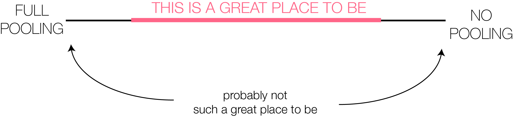

```{r setup, include=FALSE}
knitr::opts_chunk$set(echo = TRUE)
library(rstan)
```

## Introduction

This note goes over writing basic [Stan](http://mc-stan.org/) files and fitting the model in R using [RStan](https://cran.r-project.org/web/packages/rstan/). We will look at how to go from simple full/no pooling models to simple hierarchical models. The models originally come from [Daniel Lee's slides](http://astrostatistics.psu.edu/su14/lectures/Daniel-Lee-Stan-2.pdf) which are floating around the interweb. We will use the eight schools data set which is declared below,

```{r, include=TRUE}
y <- c(28, 8, -3, 7, -1, 1, 18, 12)        # treatment effect
sigma <- c(15, 10, 16, 11, 9, 11, 10, 18)  # standard error of the treatment effect
```

The data describes the treatment effect of coaching in standardized testing in eight high schools, along with the associated standard error. 

## Anatomy of a Stan File

There are seven blocks that you can define in your Stan file:

* `functions {...}` for user defined functions.
* `data {...}` to define the data used to fit the model.
* `transformed data {...}` for any transformations you want to conduct on the data.
* `parameters {...}` to define the parameters (i.e. unknowns) in your model (integers are currently not supported).
* `transformed parameters {...}` for specifying any transformations on your parameters.
* `model {...}` to define your posterior distribution (i.e. the likelihood of the data and the prior distributions of the parameters).
* `generated quantities {...}` to generate useful quantities such as posterior predictions, point-wise log likelihood, etc.

For now we will focus only on the **data**, **parameters**, and **model** blocks. Blocks are defined with the name of the block followed by curly brackets. The Stan files that we will use in this note have the following structure:

```{stan, include=TRUE, eval=FALSE, output.var="template"}
data {
// ...
}
parameters {
// ...
}
model {
// ...
}

```

All Stan files need to end with the extension `.stan`.

In order to call your stan file into the `stan()` function you need to either 1) specify the file's path on you machine or 2) set your working directory to the folder in which the file is located. (You can use the `getwd()` function and the `setwd("specify/path/here")` function to determine the current working directory or to set the working directory to `"specify/path/here"`, respectively.)

Some popular variable types that you can use in Stan are,

* `int` which defines an array of integers.
* `real` which defines an array of reals.
* `vector` which defines a vector of reals.
* `matrix` which defines a matrix of reals.

To be clear we should define the bounds on the variables we are declaring. If `N` defines one dimension of the data then it should be declared as `int<lower0> N;`. This says that `N` is an integer and the smallest value it can take is 0. This is reasonable since negative dimensions are nonsensical. You can specify bounds on parameters. This is particularly useful for scale parameters which have a lower bound of 0, or probability parameters which have a lower bound of 0 and an upper bound of 1. for example a probability parameter `p` should be declared as `real<lower=0,upper=1> p;`.

## Various Model Specifications

Full pooling and no pooling models tend to be inappropriate unless you can confidently claim that the [generative model](https://en.wikipedia.org/wiki/Generative_model) is that of a full/no pooling model. Typically, it's better to settle on a model somewhere within these extremes.

<center>
<div style="width:600px">

</div>
</center>

### Full Pooling

Here we do not consider the idiosyncracies of each school and have one scalar parameter `theta` to describe the effect of coaching. We assume that the likelihood of the data is normal. Mathematically our model is,

$$
y_i \sim \mathcal{N}(\theta, \sigma_i)\ \ \ i = 1,...,8
$$
where $\theta$ is a unknown (scalar) parameter and $\sigma_i$ is known.

The `8schools_0.stan` file is defined below,

```{stan, include=TRUE, eval=FALSE, output.var="full_pooling"}
// Full Pooling
data {
  int<lower=1> N;            // dimensions of data
  real y[N];                 // treatment effect
  real<lower=0> sigma[N];    // se of treatment effect
}
parameters {
  real theta;                // scalar parameter
}
model {
  // likelihood
  target += normal_lpdf(y | theta, sigma);
}

```

The data needs to be passed into the `stan()` function as an R `list()` The names of all the elements of the list need to match the names declared in the `data{...}` block of the Stan file. Additionally, the type of variable you're passing from R needs to match the type defined in the Stan file (i.e. if you've declared `v` to be a vector in Stan then you need to make sure that `v` is actually a vector in your data list). In this case we need to define a list that contains an integer named `N`, an N-dimensional vector called `y`, and an N-dimensional vector called `sigma`. We construct this below,

```{r, include = TRUE}
dat <- list(y = y,
            sigma = sigma)
dat$N <- length(dat$y)

names(dat)
print(dat)
```

Now we can call the stan model and data into `stan()`. Here we specify `cores = 4` since the machine that is running this document has four cores. For speed we also reduce the number of iterations to 500 (compared to the default of 2000).

Note, if any change has been made to the Stan file (including when you first write your Stan file) it will need to be recomplied. You might notice that there is no output for a while when you run `stan()`. This is because your Stan file is being translated/complied into C++ code and, depending on how complex your model is, this can take some time.

```{r, include=TRUE, results="hide"}
library(rstan)
fit0 <- stan("/Users/imad/desktop/stan/bsss/models/8schools_0.stan", data = dat,
             cores = 4, iter = 500, chains = 4)
```

Make sure that you always check the diagnostics of your model ($\hat{R}$ (`Rhat`), effective sample size (`n_eff`), traceplots, etc.). Run your model several times to ensure that the diagnostics you're seeing are consistent. 

```{r, include=TRUE, fig.align="center", fig.width=6, fig.height=3}
retro <- c(rgb(255, 102, 136, alpha = 150, max = 255),
           rgb(187, 102, 136, alpha = 150, max = 255),
           rgb(119, 102, 136, alpha = 150, max = 255),
           rgb(51, 102, 136, alpha = 150, max = 255))
print(fit0, digits = 2)
traceplot(fit0) + scale_color_manual(values = retro)
```

### No Pooling

Now we go to the other end of the spectrum and model each school separately, such that the information used to model each school is not shared amongst schools. Our model looks like,

$$
\begin{aligned}
y_1 &\sim \mathcal{N}(\theta_1, \sigma_1) \\
y_2 &\sim \mathcal{N}(\theta_2, \sigma_2)\\
&\vdots\\
y_8 &\sim \mathcal{N}(\theta_8, \sigma_8)\\
\end{aligned}
$$
The model is similar to the full pooling model except now we assume that each outcome $y_i$ has its own location parameter $\theta_i$.  

In our Stan file we model the parameters as the vector `theta`. The `8schools_1.stan` file is defined below,

```{stan, include=TRUE, eval=FALSE, output.var="no_pooling"}
// No Pooling
data {
  int<lower=1> N;            // dimensions of data
  real y[N];                 // treatment effect
  real<lower=0> sigma[N];    // se of treatment effect
}
parameters {
  real theta[N];             // array of parameters
}
model {
  // likelihood
  target += normal_lpdf(y | theta, sigma);
}

```

```{r, include=TRUE, results="hide"}
fit1 <- stan("/Users/imad/desktop/stan/bsss/models/8schools_1.stan", data = dat,
             cores = 4, iter = 500, chains = 4)
```

```{r, include=TRUE, fig.align="center", fig.width=9, fig.height=6}
print(fit1, digits = 2)
traceplot(fit1) + scale_color_manual(values = retro)
```

### Partial Pooling

Now our model gets more interesting. We settle on some middle ground between full pooling and no pooling. We do this by assuming there exists some population-level distribution (or global distribution) that all the $\theta_i$'s come from. This distribution controls the degree of pooling. Mathematically the model looks like,

$$
\begin{aligned}
y_1 &\sim \mathcal{N}(\theta_1, \sigma_1) &\mbox{likelihood}\\
y_2 &\sim \mathcal{N}(\theta_2, \sigma_2) &\vdots\\
&\vdots\\
y_8 &\sim \mathcal{N}(\theta_8, \sigma_8)\\
\boldsymbol{\theta} &\sim \mathcal{N}(\mu, 5) &\mbox{prior}\\
\mu &\sim \mathcal{N}(0,1) &\mbox{hyperprior} \\
\end{aligned}
$$

Here, the population-level location parameter $\mu$ controls the degree of pooling among the $\theta_i$s. We call this a partially pooled model because we have fixed the population-level scale parameter to equal 5, rather than estimating it by way of the posterior distribution.  

The `8schools_2.stan` file is defined below,

```{stan, include=TRUE, eval=FALSE, output.var="partial_pooling"}
// Partial Pooling
data {
  int<lower=1> N;            // dimensions of data
  real y[N];                 // treatment effect
  real<lower=0> sigma[N];    // se of treatment effect
}
parameters {
  real theta[N];             // array of parameters
  real mu;                   // hyperparameter (location)
}
model {
  // likelihood
  target += normal_lpdf(y | theta, sigma);
  // prior
  target += normal_lpdf(theta| mu, 5);
  // hyperprior
  target += normal_lpdf(mu | 0, 1);
}

```

```{r, include=TRUE, results="hide"}
fit2 <- stan("/Users/imad/desktop/stan/bsss/models/8schools_2.stan", data = dat,
             cores = 4, iter = 500, chains = 4)
```

Here, `mu` controls the degree of pooling for the individual `theta` values. 

```{r, include=TRUE, fig.align="center", fig.width=9, fig.height=6}
print(fit2, digits = 2)
traceplot(fit2) + scale_color_manual(values = retro)
```

### Hierarchical

Now we go full hierarchical. We do this by treating all of the parameters in the population-level distribution as unknown. Mathematically our model is,

$$
\begin{aligned}
y_1 &\sim \mathcal{N}(\theta_1, \sigma_1)  &\mbox{likelihood}\\
y_2 &\sim \mathcal{N}(\theta_2, \sigma_2)  &\vdots\\
&\vdots\\
y_8 &\sim \mathcal{N}(\theta_8, \sigma_8)\\
\boldsymbol{\theta} &\sim \mathcal{N}(\mu, \tau)  &\mbox{prior} \\
\mu &\sim \mathcal{N}(0,1)  &\mbox{hyperprior} \\
\tau &\sim \mathcal{N}(0,1) &\mbox{hyperprior} \\
\end{aligned}
$$

Now we are no longer treating the scale parameter $\tau$ in the population-level distribution as fixed.

The `8schools_3.stan` file is defined below,

```{stan, include=TRUE, eval=FALSE, output.var="hierarchical"}
// Hierarchical
data {
  int<lower=1> N;            // dimensions of data
  real y[N];                 // treatment effect
  real<lower=0> sigma[N];    // se of treatment effect
}
parameters {
  real theta[N];             // array of parameters
  real mu;                   // hyperparameter (location)
  real<lower=0> tau;         // hyperparameter (scale)
}
model {
  // likelihood
  target += normal_lpdf(y | theta, sigma);
  // prior
  target += normal_lpdf(theta| mu, tau);
  // hyperprior
  target += normal_lpdf(mu | 0, 1);
  target += normal_lpdf(tau | 0, 1);
}

```

```{r, include=TRUE, results="hide"}
fit3 <- stan("/Users/imad/desktop/stan/bsss/models/8schools_3.stan", data = dat,
             cores = 4, iter = 500, chains = 4)
```

The variables `mu` and `tau` control the degree of pooling of the individual `theta` values for each school. 

```{r, include=TRUE, fig.align="center", fig.width=9, fig.height=6}
print(fit3, digits = 2)
traceplot(fit3) + scale_color_manual(values = retro)
```

### Hierarchical (Unstable)

In the model above we assigned hyperpriors to the hyperparameter `mu` and `tau`. This is important. If we don't "guide the search" for these parameters then it becomes difficult for the sampler to explore the posterior distribution and for the parameter values to appropriately converge. Typically, in high-dimensional problems with sparse data it is a good idea to assign informative priors on hyperparameters.

The `8schools_4.stan` file is defined below,

```{stan, include=TRUE, eval=FALSE, output.var="hierarchical_unstable"}
// Hierarchical (Unstable)
data {
  int<lower=1> N;            // dimensions of data
  real y[N];                 // treatment effect
  real<lower=0> sigma[N];    // se of treatment effect
}
parameters {
  real theta[N];             // array of parameters
  real mu;                   // hyperparameter (location)
  real<lower=0> tau;         // hyperparameter (scale)
}
model {
  // likelihood
  target += normal_lpdf(y | theta, sigma);
  // prior
  target += normal_lpdf(theta| mu, tau);
  // hyperprior
  // target += normal_lpdf(mu | 0, 1);
  // target += normal_lpdf(tau | 0, 1);
}

```

```{r, include=TRUE, results="hide"}
fit4 <- stan("/Users/imad/desktop/stan/bsss/models/8schools_4.stan", data = dat,
             cores = 4, iter = 500, chains = 4)
```

The issues when fitting this sort of model should be obvious when looking at the diagnostics. Visually, we see poor mixing among chains.

```{r, include=TRUE, fig.align="center", fig.width=9, fig.height=6}
print(fit4, digits = 2)
traceplot(fit4) + scale_color_manual(values = retro)
```
